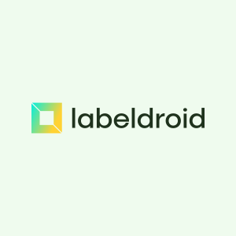

  

# LabelDroid

**LabelDroid** 是一个基于 [Tauri](https://tauri.app/) + [Vue 3](https://v3.vuejs.org/) + [TypeScript](https://www.typescriptlang.org/) 构建的现代化跨平台图像标注工具。其旨在提供类似 **LabelMe** 的标注体验，同时借助于 Rust 提供的高效本地计算和 Tauri 带来的极小打包体积，支持在 Desktop 和 Android 平台上运行。

## ✨ 功能特色

- 🎯 **精细化多边形标注 (Polygons & Shapes)**: 提供直观且易于上手的多边形绘制体验，支持控制点的灵活新增、删除与拖拽编辑，轻松满足复杂的物体轮廓提取需求。
- 🔍 **无限缩放与丝滑交互 (Infinite Canvas)**: 借助高性能 HTML5 Canvas 渲染引擎，完美支持鼠标滚轮缩放、触控板手势以及自由拖拽平移，在处理 4K+ 甚至更高分辨率的大图时依然如丝般顺滑。
- 📱 **全平台无缝覆盖 (Cross-Platform)**: 一套操作逻辑，多端无差别运行。无论是专注于办公室桌面的 Windows、macOS 平台(需要自行构建)，还是需要现场作业时的 Android 移动平板设备，均能享受到原生的交互体验和性能表现。
- 📦 **完全兼容 LabelMe 生态**: 数据不仅限于闭环！软件采用标准且通用的 LabelMe JSON 数据格式进行导入导出。原有的开源数据集资源可直接接入，您的标注结果也可无缝用于主流深度学习或计算机视觉等下游算法训练任务中。
- 🚀 **极致轻量启动迅速**: 告别传统 Electron 庞大臃肿的痛点，依托于超微内核 (Tauri 配合系统 WebView) 以及底层 Rust 构建的高效并行服务，使得 App 安装包极小化且内存占用也保持在极低水平。

## 🚀 快速开始

请前往项目的 **[Releases](/releases)** 页面下载对应平台（Windows 或 Android）的最新安装包。

下载完成后，直接安装即可开箱使用，无需配置任何复杂的开发环境！

Windows APP 数据集目录: ~/Documents/labeldroid/datasets

Android App 数据集目录: /storage/emulated/0/Android/data/com.initialencounter.labeldroid/files/Documents

## 📄 协议

基于 [MIT License](LICENSE) 协议开源